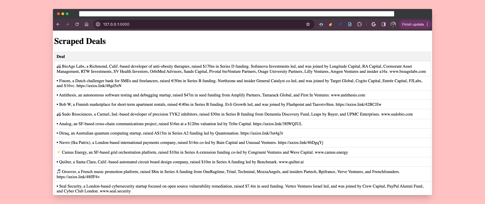

# Scraped Deals Web Application

This is a Flask web application designed to scrape daily new investment deals from Axios and display them on a web page. The application utilizes Selenium for web scraping and Flask for web development.
# Demo

Access the demo here: https://demo-axios-scrape-3c54255ff0b4.herokuapp.com/


# Prerequisites
Before running this application, ensure you have the following installed on your system:

- Pyhon 3.x
- Flask
- Selenium
- Chrome WebDriver

# Installation
1. Clone this repository to your local machine:

``` bash
git clone https://github.com/yourusername/your-repository.git
```
2. Install the required Python packages:
``` bash
pip install -r requirements.txt
```
3. Download and install the Chrome WebDriver from the official website.

## Usage
1. Ensure you have a list of search strings in an Excel file named **funds-list.xlsx**. Modify the file path and sheet name in the **get_search_strings()** function if necessary.

2. Run the Flask application:

``` bash
python main.py
```
3. Access the application in your web browser at http://localhost:5000/.

# File Structure
The structure of the files in this project is as follows:

- app.py: The main Flask application file containing routes and functions for web scraping and data rendering.
- templates/index.html: HTML template for displaying scraped data on the web page.
- scraped_data.json: JSON file containing the scraped deal titles.
- funds-list.xlsx: Excel file containing search strings.
- requirements.txt: List of Python dependencies.

# Deployment Configuration
This code is configured for deployment on Heroku, including the setup of Chrome WebDriver for headless browsing. If you intend to run the application locally, you will need to make modifications to accommodate local Chrome WebDriver setup.

# Local Deployment
To run the application on a local server, follow these steps:

1. Comment out or remove the Heroku-specific configurations in app.py related to Chrome WebDriver setup and uncomment the local configurations.

``` bash
# Heroku configuration
file_path = os.path.join(os.path.dirname(os.path.abspath(__file__)), file_name)
...
chrome_options.binary_location = os.environ.get("GOOGLE_CHROME_BIN")
...
chrome_options.add_argument("--headless")
...
with open(output_file, 'a') as json_file:
```
2. Uncomment and modify the local configurations:
``` bash
# Local configuration
file_path = '/[yourpath]/funds-list.xlsx'
...
chrome_options.binary_location = r"/Applications/Chrome.app"
```
Replace [yourpath] with the path to your local Chrome WebDriver executable.

Ensure you have Chrome WebDriver installed locally. You can download it from the official website.


# License
This project is licensed under the MIT License - see the LICENSE file for details.

# Screenshots




